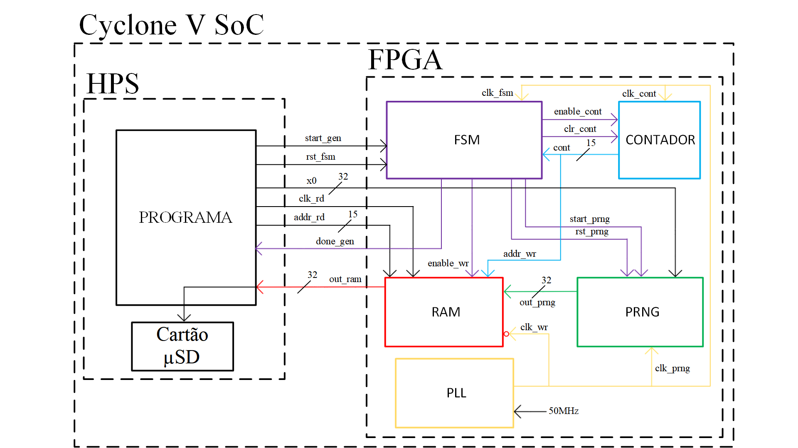

# Gerador de Números Aleatórios Baseado no k-Mapa Logístico

Sistema de geração e armazenamento de 2^20 bits aleatórios gerados por um PRNG baseado no k-mapa logístico.

## Dispositivo

Implementado na placa de desenvolvimento Terasic DE10-Nano (SoC Cyclone V FPGA)

## Referências Bibliográficas
KOTAKI, M. M. A.; LUPPE, M. FPGA Implementation of a Pseudorandom Number Generator Based on k-Logistic Map. **IEEE 11th Latin American Symposium on Circuits & Systems (LASCAS)**, San Jose, pp.1-4, 2020. doi: 10.1109/LASCAS45839.2020.9068999.

## Licença 
[MIT License](https://choosealicense.com/licenses/mit/)

2021
